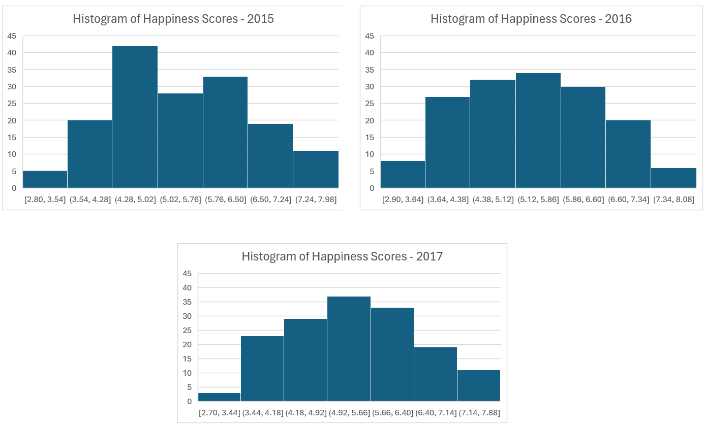

# World Happiness Scores in 2015-2017

## Introduction
The first World Happiness Report was published in 2012, which aimed to study subjective well-being around the world (Helliwell, Huang, & Wang, 2017). Individuals in the World Happiness Report were asked the Cantril ladder question: “Please imagine a ladder, with steps numbered from 0 at the bottom to 10 at the top. The top of the ladder represents the best possible life for you and the bottom of the ladder represents the worst possible life for you. On which step of the ladder would you say you personally feel you stand at this time?” Six variables were identified as explaining differences in happiness scores among countries including: GDP per capita, healthy years of life expectancy, social support (defined as having a person to depend on during difficulties), trust (defined as the view that government and businesses are not engaged in corrupt practices), perceived freedom to make life decisions, and generosity (defined by new donations) (Helliwell, Huang, & Wang, 2017).

## Project aims
The current data analysis explored world happiness scores in 2015 to 2017. This project aimed to answer the following questions:
1.	What were the happiness trends globally in the years from 2015 to 2017?
2.	Which countries have the happiest ratings overall?
3.	Which countries have the unhappiest ratings overall?
4.	What are the happiness score trends in the U.S.?

## Results
This data analysis project used Excel to clean and analyze the dataset. This project also utilized Tableau to visualize the happiness scores globally. The dataset involved 158 countries/territories in 2015, 157 countries/territories in 2016, and 155 countries/territories in 2017. The differences in sample size across the three years can be attributed to some countries having inconsistent provisions of data (i.e., happiness scores) across all three years. For example, Djibouti provided data for 2015, but not for 2016 or 2017. Overall, 148 countries/territories had happiness scores for all three years (i.e., 2015, 2016, and 2017).

When calculating the mean happiness score globally (based on the above-referenced samples), the average happiness score globally was 5.38 in 2015, 5.39 in 2016 and 5.36 in 2017.  Global happiness scores demonstrated stability over the course of these three years. The histograms below demonstrate the distributions of happiness scores for 2015, 2016, and 2017 respectively. Additionally, maps representing happiness scores from 2015 to 2017 are depicted below. (To view the interactive map on Tableau, please click the link [here](https://public.tableau.com/app/profile/sarah.sadeghi/viz/WorldHappinessDataScores/Sheet2)). 

 

 

 
 

 

  
 

When examining trends of whether happiness scores are increasing, decreasing, or remaining constant from 2015 to 2017, 43% of countries (65 countries) indicated an increase in happiness score, 42% of countries (63 countries) reported a decrease in happiness score, with 15% of countries (23 countries) remaining constant in their happiness score. Many fluctuations in the happiness scores were minimal from 2015 to 2017. However, the country to show the most substantial increase in its happiness score from 2015 to 2017 was Togo, which demonstrated a 25% increase in its happiness score (from 2.80 to 3.50). No other countries demonstrated more than a 20% increase in happiness scores. However, five countries showed a substantial decrease in their happiness scores of 20% or more including Central African Republic (from 3.70 to 2.70), Liberia (from 4.60 to 3.50), Haiti (from 4.50 to 3.60), Lesotho (from 4.90 to 3.80), and Venezuela (from 6.80 to 5.30).

From 2015 to 2017, the countries that reported being happiest on average included Switzerland (7.53 happiness score) and Iceland (7.53 happiness score). However, in 2017, there were 5 countries that tied for happiest country including: Switzerland, Iceland, Norway, Denmark, and Finland, which all scored a 7.50 happiness score. 

From 2015 to 2017, the country that reported being unhappiest on average was Burundi (2.90 happiness score). Other countries that reported the unhappiest ratings on average during 2015 to 2017 included Syria (3.20), Togo (3.20), and Central African Republic (3.20). Furthermore, in 2017, the Central African Republic earned the lowest happiness rating of 2.70 of all the countries in the sample.

Regarding the happiest score trends in the U.S. from 2015 to 2017, the U.S. was rated consistently higher than the global average in all three years. Specifically, the U.S. happiness score was 7.10 in 2015 and 2016. In 2017, the U.S. earned a happiness score of 7.00. While there was a slight decline of the happiness score in 2017 compared to 2015 and 2016, the U.S. overall did not fall far behind the happiest reported countries in the dataset.

## Conclusion / Summary
•	**Overall happiness trends:** Happiness scores were compiled for most countries/territories globally in 2015, 2016, and 2017. Average happiness scores globally remained consistent throughout this time period (5.38, 5.39, and 5.36 respectively). 

•	**The happiest countries:** The happiest countries during 2015 to 2017 are consistently found in Europe, specifically, Switzerland, Iceland, Norway, Denmark, and Finland, which all scored a 7.50 happiness score in 2017. According to Helliwell, Huang, and Wang (2017) the top ten countries that scored the highest on happiness also scored highly on six factors: GDP per capita, healthy years of life expectancy, social support (defined as having a person to depend on during difficulties), trust (defined as the view that government and businesses are not engaged in corrupt practices), perceived freedom to make life decisions, and generosity (defined by new donations).

•	**The unhappiest countries:** Of the four unhappiest countries during the years 2015 to 2017, three are found in Africa, specifically Burundi (2.90), Togo (3.20), and Central African Republic (3.20). The fourth unhappiest country was Syria (3.20), located in Asia. Møller, Roberts, Tiliouine, and Loschky (2017) have noted that there is a trend for African countries to be lower on the happiness score compared to other countries globally. Despite a development in democracy and an improvement in meeting basic needs, people in African nations tend to experience lower levels of happiness, which may be attributed in part to a dissatisfaction with governments in addition to limited opportunities for infrastructure, and youth development with population pressure (Møller, Roberts, Tiliouine, & Loschky, 2017).

•	**U.S. happiness trends:** Regarding the happiest score trends in the U.S. from 2015 to 2017, the U.S. was rated consistently higher than the global average in all three years, with an average score of 7.07 during this time; however, there was a slight decrease in the happiness score in 2017. According to the Happiness Report (Sachs, 2017), the U.S. showed an increase in income and healthy life expectancy in 2017, which are two variables that generally account for the happiness score. However, the overall decline in the U.S. happiness score in 2017 can be accounted for by worse outcomes in four social variables, including: decreased social support, less personal freedom, decreased donations, and increased views of corrupt government and business practices (Sachs, 2017).

## Recommendations
•	A future qualitative study would be recommended to understand what factors would improve life satisfaction and happiness, especially among the identified unhappiest countries.

•	Future research could also focus on longitudinal studies of countries with significant happiness score fluctuations to identify key interventions that led to improvements.
